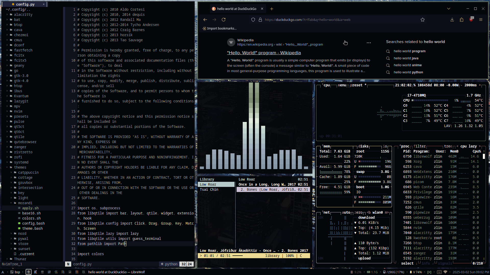
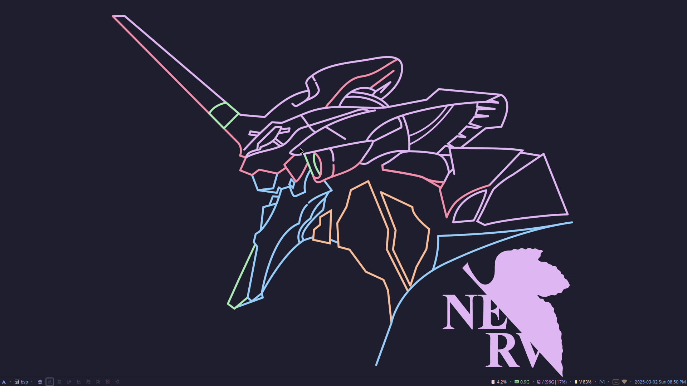
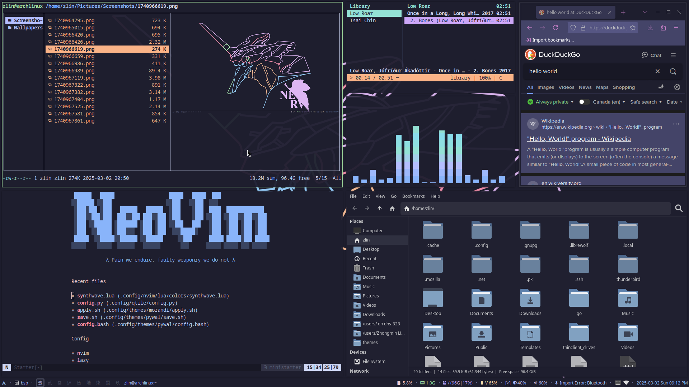
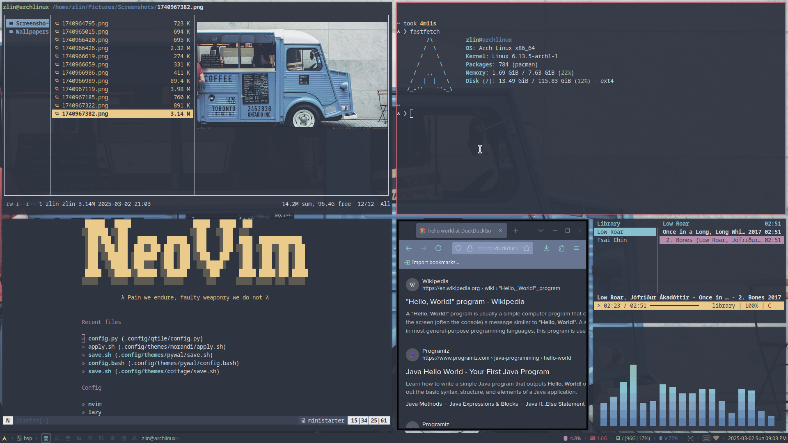
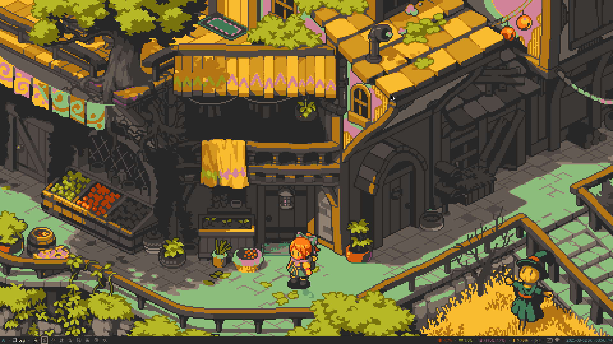
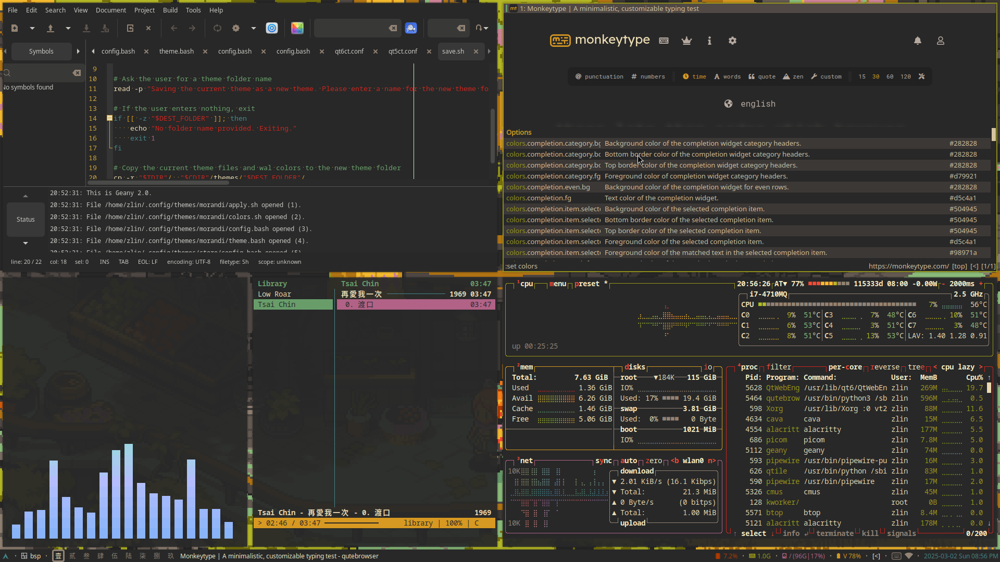
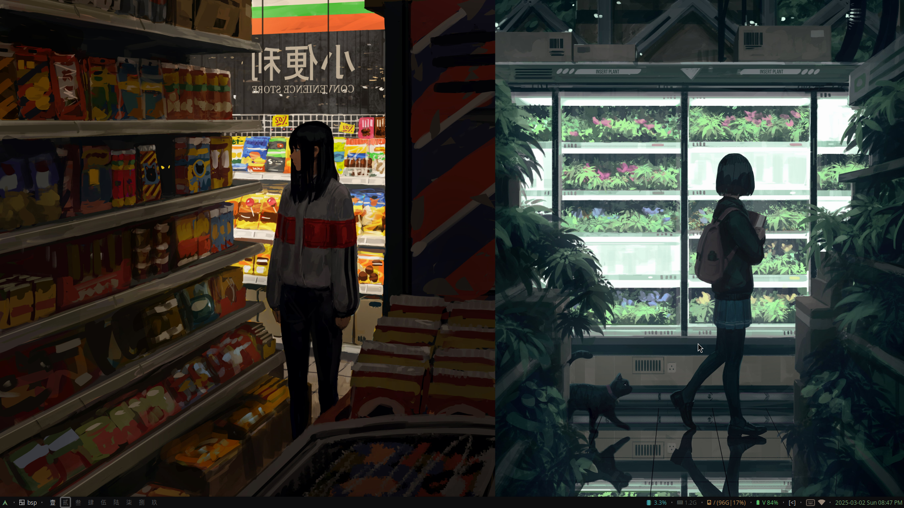
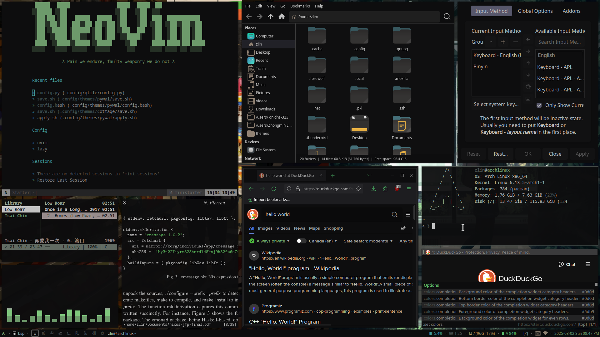
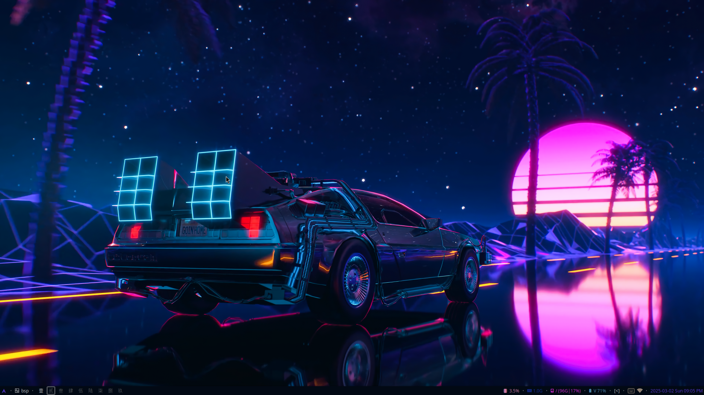
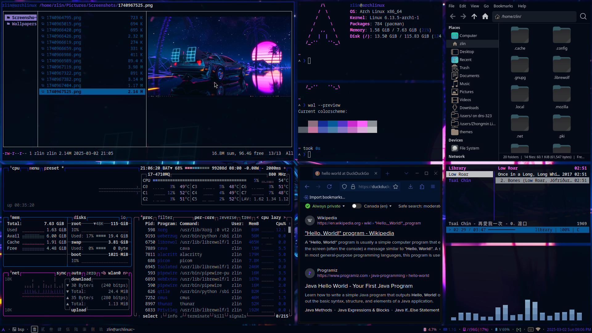

# dotfiles
## set up
install [chezmoi](https://github.com/twpayne/chezmoi)
### arch
```bash
sudo pacman -S chezmoi
```
### void
```bash
sudo xbps-install -S chezmoi
```
## apply config
```bash
chezmoi init git@github.com:zhongminlin/dotfiles.git --branch <branch_name> --apply
```
## download packages
### arch
```bash
sudo pacman -S ~/.config/arch_pkglist
# or
sudo pacman -S ~/.config/arch_pkg
```
### void
```bash
sudo xbps-install -S ~/.config/void_pkg
```
## screenshots












